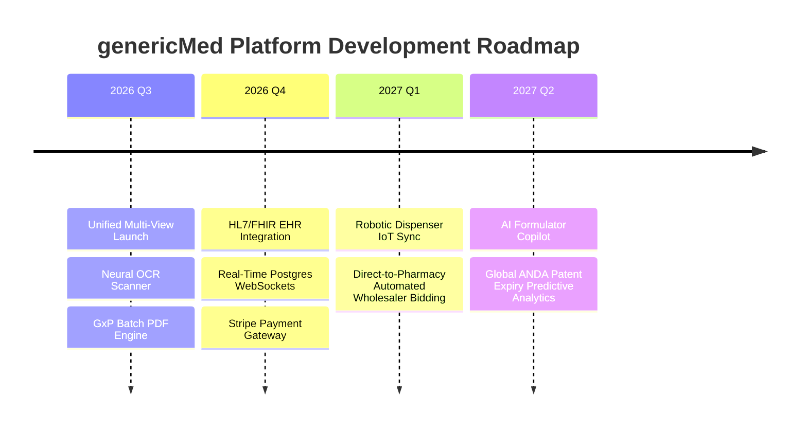

# Long-Term Project Memory (memory.md)

This document serves as the persistent memory store for **genericMed — B2B Health OS & Generic Medicine Platform**. It contains architectural state, implemented capabilities, database schemas, active business logic, known issues, and the future product roadmap.

---

## 1. Project Overview

**genericMed** is a production-grade multi-tenant B2B Health OS and Generic Medicine Platform designed to bridge the gap between pharmaceutical manufacturers, clinical micro-hub dispensing pharmacies, telehealth partners, and retail patients.

### Core Value Proposition:
1. **Clinical Health OS & Dispensing Queue:** Streamlines high-throughput pharmacy dispensing with automated OCR prescription verification, cold-chain monitoring, and batch label printing.
2. **FDA Bioequivalence Catalog:** Provides real-time f2 dissolution similarity metrics, confidence interval calculations (AUC/Cmax), and batch Certificates of Analysis (CoA).
3. **Multi-Tenant Infrastructure Core:** Monitors schema isolation, PostgreSQL Row-Level Security (RLS) policies, and query latency across healthcare organizations.
4. **Salt Mapping & Arbitrage Engine:** Identifies financial yield opportunities by mapping expensive innovator brand drugs to FDA AB-rated generic chemical salts.
5. **Patient Mobile Web Portal:** Delivers real-time price comparison across local partner pharmacies, prescription vault management, and auto-refill scheduling.

---

## 2. Technical Stack

| Layer | Technology | Details / Version |
| :--- | :--- | :--- |
| **Frontend Framework** | React 19 | Functional components with Hooks, Concurrent Mode (`^19.0.1`) |
| **Build Tool & HMR** | Vite 6 | Lightning-fast module bundling (`^6.2.3`) |
| **Language** | TypeScript 5.8 | Strict typing across all data models & components (`~5.8.2`) |
| **Styling** | Tailwind CSS v4 | Modern utility CSS framework (`^4.1.14`) |
| **Icons** | Lucide React | Clean healthcare and dashboard iconography (`^0.546.0`) |
| **Animations** | Framer Motion | Smooth UI modal and page transition effects (`^12.23.24`) |
| **Visualization** | Recharts | Interactive price arbitrage and telemetry charts (`^3.10.1`) |
| **Backend Server** | Express | Micro-service API endpoints (`^4.21.2`) |
| **AI Integration** | @google/genai | Gemini 2.5 Flash for Neural OCR & Bioequivalence AI (`^2.4.0`) |
| **Document Export** | jsPDF | Client-side GxP PDF Certificate & Label generator (`^4.2.1`) |

---

## 3. Features Completed

- [x] **Top Navigation & Multi-View Switcher (`Navigation.tsx`):** Seamless switching between 8 workspace modes (`AppViewMode`).
- [x] **Multi-Role Authentication Portal (`AuthScreen.tsx`):** Pre-seeded demo user sessions for Patient, Pharmacist, and Wholesaler roles with persistent `localStorage` integration.
- [x] **Clinical Micro-Hub Dispensing OS (`ClinicalHealthOS.tsx`):** Live dispatch queue with status filtering, cold-chain temperature telemetry, courier PIN assignment, and priority badges.
- [x] **FDA Bioequivalence & Formulation Catalog (`CatalogBioequivalence.tsx`):** Chemical parity ratings (AB, AB1, AB2, AP), f2 dissolution similarity calculation, and interactive Batch CoA inspector (`BatchCoAModal.tsx`).
- [x] **Multi-Tenant Schema Health Monitor (`InfrastructureCore.tsx`):** RLS policy verification, daily query throughput tracker, and AES-256 encryption status per tenant organization.
- [x] **Consumer Mobile Web & Price Comparator (`ConsumerApp.tsx`):** Generic drug search, pack size selection, local pharmacy stock levels, cart checkout flow, and prescription vault.
- [x] **Enterprise Analytics Dashboard (`EnterpriseAnalytics.tsx`):** Financial yield arbitrage overview, innovator vs generic savings trends, and tier pricing distribution charts.
- [x] **Salt Mapping Engine (`SaltMappingEngine.tsx`):** Innovator brand salt mapping to generic SKUs, Orange Book patent expiry tracking, and active manufacturer listings.
- [x] **Neural OCR Prescription Scanner (`PrescriptionScanModal.tsx`):** Real-time image upload analysis powered by Gemini AI for automatic NDC and dosage extraction.
- [x] **Auto-Refill & Push Notification Scheduler (`PushRefillScheduler.tsx`):** Days-supply calculator, lead-time customization, and scheduled notification queue.
- [x] **21 CFR Part 11 PDF Export Engine (`generatePrescriptionPdf.ts`):** Tamper-evident digital batch label printing and GxP validation certificate downloads.

---

## 4. Pending Features

- [ ] **HL7 / FHIR Standard EHR Integration:** Direct bidirectional sync with Epic and Cerner EHR systems for live prescription importing.
- [ ] **Live Supabase / Postgres Database Integration:** Replace mock dataset with real-time WebSocket database subscriptions.
- [ ] **Stripe / Healthcare HSA Payment Gateway:** Full e-commerce checkout processing for direct-to-patient deliveries.
- [ ] **Robotic Dispenser IoT Sync:** MQTT protocol integration with micro-hub automated pill-filling hardware isolators.

---

## 5. Backend API Endpoints (Express Server)

The Express server (`server.js` / `tsx` runtime) exposes the following API routes:

| Method | Endpoint | Description | Query / Body Payload |
| :--- | :--- | :--- | :--- |
| `GET` | `/api/health` | System health check & GxP validation status | None |
| `POST` | `/api/ocr/scan-prescription` | Process prescription image via Gemini 2.5 Flash OCR | `{ imageBase64: string }` |
| `GET` | `/api/tenants` | Fetch active tenant schema records and RLS status | `?status=HEALTHY` |
| `GET` | `/api/dispense-queue` | List micro-hub dispensing orders | `?priority=RUSH&hubId=042` |
| `POST` | `/api/refill-schedule` | Create scheduled auto-refill alert | `{ rxId, leadDays, alertDate }` |
| `POST` | `/api/coa/verify` | Verify cGMP batch Certificate of Analysis hash | `{ lotNumber, ndcCode }` |

---

## 6. Database Schema Summary (PostgreSQL Multi-Tenant)

### Core Tables & Isolated Schemas

#### 1. `tenants` (Public Schema)
```sql
CREATE TABLE public.tenants (
  id UUID PRIMARY KEY DEFAULT gen_random_uuid(),
  organization_name VARCHAR(255) NOT NULL,
  tenant_type VARCHAR(50) NOT NULL, -- Retail Pharmacy | Hospital GPO | Pharma Manufacturer
  schema_identifier VARCHAR(100) UNIQUE NOT NULL, -- e.g. tenant_mediquick_042
  rls_policy_count INT DEFAULT 12,
  encryption_algorithm VARCHAR(50) DEFAULT 'AES-256-GCM',
  status VARCHAR(20) DEFAULT 'HEALTHY',
  created_at TIMESTAMP WITH TIME ZONE DEFAULT NOW()
);
```

#### 2. `formulations` (Tenant Schema)
```sql
CREATE TABLE tenant_schema.formulations (
  id UUID PRIMARY KEY DEFAULT gen_random_uuid(),
  chemical_name VARCHAR(255) NOT NULL,
  cas_number VARCHAR(50) NOT NULL,
  innovator_reference_brand VARCHAR(255) NOT NULL,
  dosage_strength VARCHAR(100) NOT NULL,
  fda_approval_code VARCHAR(100) NOT NULL, -- e.g. ANDA #210482
  bioequivalence_rating VARCHAR(10) NOT NULL, -- AB | AB1 | AB2 | AP
  f2_dissolution_similarity NUMERIC(5,2) NOT NULL, -- e.g. 78.40
  auc_ratio_confidence_interval VARCHAR(100) NOT NULL,
  cmax_ratio_confidence_interval VARCHAR(100) NOT NULL,
  active_lot VARCHAR(50) NOT NULL,
  co_a_status VARCHAR(50) NOT NULL -- Verified cGMP | Pending QC
);
```

#### 3. `dispense_orders` (Tenant Schema)
```sql
CREATE TABLE tenant_schema.dispense_orders (
  id UUID PRIMARY KEY DEFAULT gen_random_uuid(),
  order_number VARCHAR(50) UNIQUE NOT NULL,
  generic_name VARCHAR(255) NOT NULL,
  brand_equivalent VARCHAR(255) NOT NULL,
  dosage VARCHAR(100) NOT NULL,
  ndc VARCHAR(20) NOT NULL,
  patient_name VARCHAR(255) NOT NULL,
  prescribing_doctor VARCHAR(255) NOT NULL,
  priority VARCHAR(20) DEFAULT 'Normal', -- RUSH <30m | High | Normal
  status VARCHAR(50) DEFAULT 'OCR Verified',
  cold_chain_required BOOLEAN DEFAULT FALSE,
  temperature_celsius NUMERIC(4,1),
  price NUMERIC(10,2) NOT NULL
);
```

---

## 7. Important Business Logic Rules

1. **FDA AB-Rating Bioequivalence Rule:**
   - Dissolution Similarity Score ($f_2$) MUST be $\ge 50.0\%$ to qualify for bioequivalent generic substitution.
   - 90% Confidence Interval for $AUC$ and $C_{max}$ ratios MUST fall strictly within $80.00\% - 125.00\%$.
2. **Cold-Chain Safety Telemetry:**
   - Temperature range for refrigerated biologics/salts must be maintained between $2.0^\circ\text{C}$ and $8.0^\circ\text{C}$.
   - Telemetry exceeding $8.0^\circ\text{C}$ automatically triggers a `Clinical Hold` status on the dispatch item.
3. **Price Arbitrage Yield Calculation:**
   $$\text{Yield \%} = \left( \frac{\text{Innovator Price} - \text{Generic Floor Price}}{\text{Innovator Price}} \right) \times 100$$
4. **Days-Supply Run-Out Date Algorithm:**
   $$\text{Run-Out Date} = \text{Current Date} + \left( \frac{\text{Tablets Remaining}}{\text{Daily Dosage Units}} \right) \text{ Days}$$

---

## 8. Known Issues & Operational Considerations

- **Local Storage Multi-Tab Sync:** Active user state changed in one tab does not automatically emit cross-tab event listeners in older browser versions.
- **Mock Data Fallback:** When `GEMINI_API_KEY` is absent, `PrescriptionScanModal` falls back to pre-seeded neural OCR mock parsing.
- **PDF Browser Print Preview:** Printing complex tables in Firefox occasionally requires landscape orientation mode to avoid page clipping.

---

## 9. Future Roadmap


